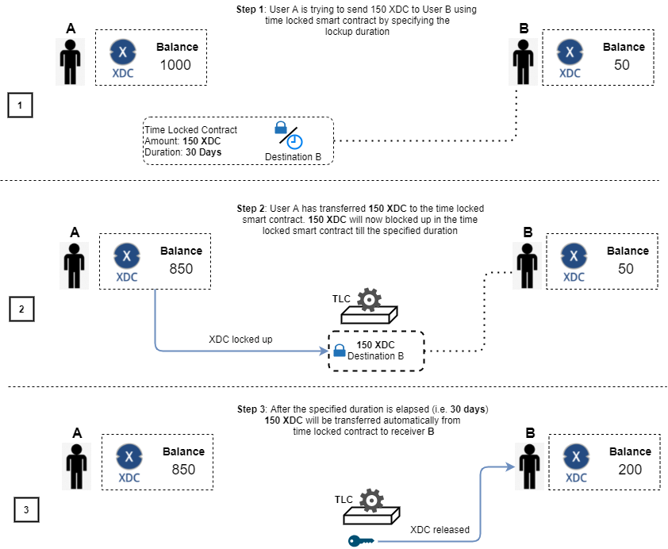
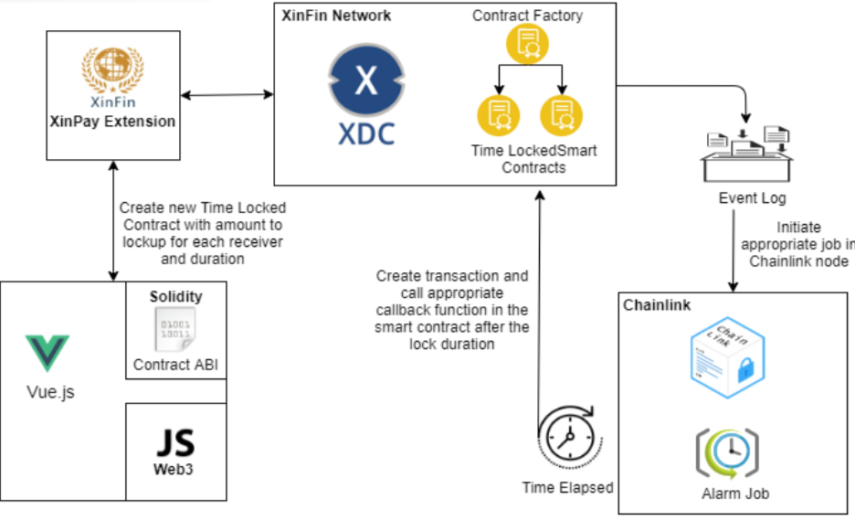
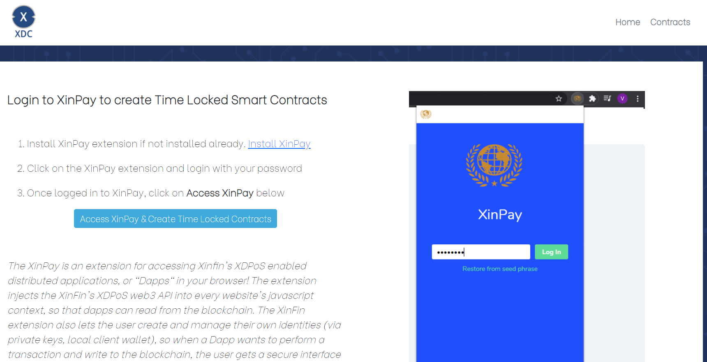
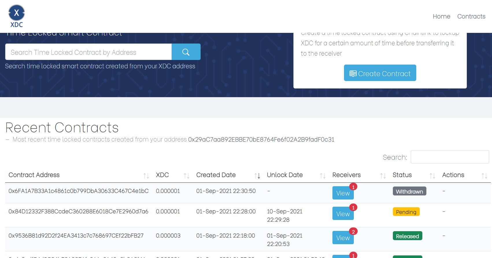
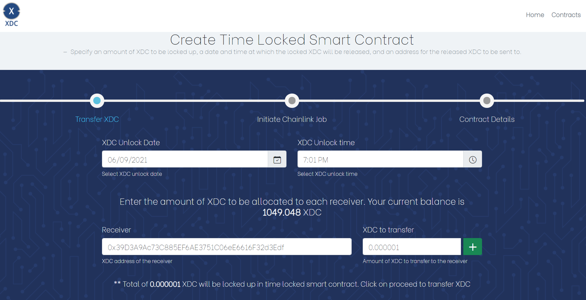

# XDC-Smart-Contract-Tool
[](https://xinfin.org/)

# Time Locked Smart Contracts
---
Create Time locked smart contracts where the time is sourced from a Plugin oracle.  A user would specify an amount of XDC to be locked up, a date and time at which the locked XDC will be released, and an address for the released XDC to be sent to.

# Table of contents
---
   * [Overview](#overview)
   * [Prerequisite](#prerequisite)
   * [Tools & Technologies](#tools--technologies)
   * [Configuring Plugin Job](#configuring-plugin-job)
   * [Deploying Time Locked Contracts](#deploying-time-locked-contracts)
   * [Configuring the Application](#configuring-the-application)
   * [Building the Application](#building-the-application)
      * [Using npm](#using-npm)
      * [Using Docker](#using-docker)
   * [Accessing the Application](#accessing-the-application)
      * [Login](#login)
      * [Contracts](#contracts)
      * [New Contract](#new-contract) 
      
## Overview
---
Time Locked Smart Contract is a feature which allows users to send XDC payments to multiple receivers. These conditional payments, sets the XDC aside and transfers it to receivers when the time is elapsed. 
After the expiration time, only the intended receivers can get the locked up XDC.



## Prerequisite
---
This application requires integration of [XDC Network](https://xinfin.org/) Network with [Plugin](https://chain.link/). 
It is recommended to follow [XinFin-Plugin](https://github.com/XinFinOrg/XinFin-Plugin) guide and setup all the required applications which includes -   

- Plugin node
- Plugin - External Initiator
- Deploying PLI token contract 
- Deploying Oracle contract 

## Tools & Technologies
---

Following tools and technologies have been usse to develop Time Locked Smart Contract application -

- Node.js 12.8 - https://nodejs.org/en/
- Vue.js 4.x - https://v3.vuejs.org/
- Bootstrap 5.x - https://getbootstrap.com/
- web3 / xdc3 1.3.x - https://web3js.readthedocs.io/en/v1.5.2/
- XinPay 6.0.0 - 6.0.0 - https://chrome.google.com/webstore/detail/xinpay/bocpokimicclpaiekenaeelehdjllofo?hl=en
- Plugin 0.0.1 - https://chain.link/
- Solidity 0.4.24 - https://docs.soliditylang.org/en/v0.8.7/



## Configuring Plugin Job
---

Create an [Alarm Job](https://docs.chain.link/docs/chainlink-alarm-clock/) in Plugin node. Steps to create Alarm Job -

- Login to Plugin node
- Navigate to **Jobs** and click on **New Job**
- Copy the job specification form **plugin/alarm-job.json** file
- Paste the contents into the **Json Spec** field and create the job 
- Copy the newly created job ID which we will be using later

## Deploying Time Locked Contracts
---
Compile and deploy the contracts required for Time Locked Smart Contract creation using [remix](https://remix.xinfin.network/) editor.

- **contracts/TimeLockedContractFactory.sol** - Factory contract used to create Time Locked Contracts and tracks all the contracts created by users. 
- **contracts/TimeLockedContract.sol** - Contract implementing PluginClient which is responsible for initiating Alarm Job in Plugin and implements the callback function which will be invoked on time expiry. Stores all the information related to the contract which includes - 
  - Receivers and corresponding XDC to be locked up
  - Unlock date

Deploy the **TimeLockedContractFactory** using [remix](https://remix.xinfin.network/) editor and take a note of the deployed contract address which we will be using later. 

By the end of this step we should have following addresses - 

| Keyword | Description |
| ------ | ------ |
| **TLW_FACTORY_CONTRACT_ADDR** | Address of the deployed Time Locked Contract Factory |
| **PLI_TOKEN_CONTRACT_ADDR** | Address of the deployed PLI token contract |
| **ORACLE_CONTRACT_ADDR** | Address of the deployed Oracle contract |
| **PLUGIN_JOB_ID** | Address of the alarm job created in Plugin node |


## Configuring the Application
--

Before building or running the application following fields values should be replaced in **ui/src/assets/js/config.js**.

**NOTE**: Network id **51** refers to XDC Apothem network and **50** refers to XDC Main network

- TLW_FACTORY_CONTRACT_ADDR
- PLI_TOKEN_CONTRACT_ADDR
- ORACLE_CONTRACT_ADDR
- PLUGIN_JOB_ID


## Building The Application
---

### Using npm 

- For local development, run the below command from project root directory and access the application using http://localhost:3000 
    ```sh
    npm install
    npm run serve -- --port 3000
    ```

- For production environments, run the below command and once the build is successful final artifacts should be available in **dist/** directory
    ```sh
    npm run build
    ```

### Using Docker

```sh
docker build -t tlc .
docker run -p 8080:8080 tlc
```

## Accessing the Application
---

### Login
---
- An account in [XDCPay](https://chrome.google.com/webstore/detail/xinpay/bocpokimicclpaiekenaeelehdjllofo?hl=en) is required to access the application. Users will approve the transaction using XDCPay.  
- Make sure the address added in XDCPay has sufficient XDC based on the network being used.
- Add the Link token address in XDCPay wallet and make sure there is sufficient PLI balance.



### Contracts
---
Displays the list of contracts created by the user with following information -

| Field | Description |
| ------ | ------ |
| Contract Address | Address of the Time Locked Contract   |
| XDC | Total amount of XDC locked up |
| Created Date | Contract creation date |
| Unlock Date | XDC release date |
| Receivers | Total number of receivers and corresponding XDC locked up |
| Status | Status of the transaction |

User will be provided with following actions based on the contract status -  

| Action | Description |
| ------ | ------ |
| Transfer Link Token | This option will be available only if PLI token is not transferred to the contract. Using this option PLI token can be transferred to the contract to initiate the Plugin job  |
| Withdraw Contract | This option will be available only if PLI token is not transferred and when contract is not initiated. Using this option user can withdraw the total allocated XDC back to wallet|



### New Contract
---
Creating Time Locked Contract is a 2 step process, which includes - 

- Creating a new Contract 
- Transferring the PLI token and initiating Alarm Job in Plugin



##### Creating a new Contract 

- User specifies the duration of XDC lockup
- Amount of XDC to be allocated to each receiver

On contract creation, XDC will be transferred from user's wallet to the new contract.

##### Transferring the PLI token and initiating Alarm Job in Plugin

In this step, PLI token (Link fee) will be transferred to the created contract. Link fee is required to initiate the job  Plugin job.

